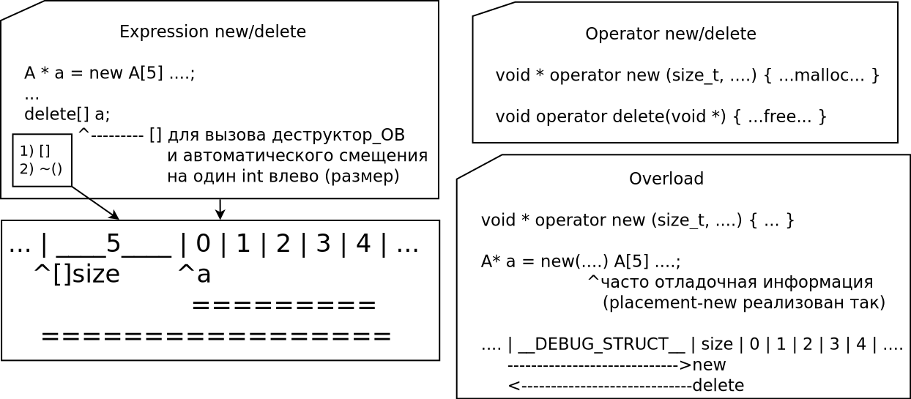

# Allocations

## C style

> malloc, calloc, free, realloc

## C++ style

> new, delete

! Нет реаллокации, т.к. есть опасность инвалидации указателей

> POD типы - типы, для которых нет ООП семантики (?)

```
    std::copy(...) вызывает memcpy для POD типов
```

### operator new

КИДАЕТ ИСКЛЮЧЕНИЕ! -- важно ловить исключение в конструкторе

```
    set_terminate - свой перехватчик
```

```

    new -> malloc -> nullptr -> 

    ---> int new_handler() -> != 0 -> malloc вызывается снова
                           -> == 0 -> exception 

         ! you can define your own new_handler()
```

STL port



> Эллис, Страуструп - проглядеть
