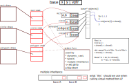

# Таблица виртуальных функций

## Разработка принципа с нуля на Си

* выстроено ''наследование'', и для каждой ''отнаследованной'' структуры
  определена функция, отрисовывающая содержимое структуры на экране:

```
           |--> dot         - draw(dot* dot_p)
object ----|--> rectangle   - draw(rectangle* rec_p)
           |--> circle      - draw(circle* circ_p)
```

1. Создаём функцию `universal_draw(object* obj_ptr)`, но она не умеет 
рисовать наследников. Можно создать поле `int typeid` и вызывать соответствующую 
функцию в switch'е. Чтобы не дописывать кейс, можно хранить указатель на функцию.

2. Определяем много одинаковых функций для каждого наследника: `erase(), scale(), ...`

```
Внутри каждого класса:

{
void (*draw)(...)
....
void (*scale)(...)
}

-> перегружает объект, копипаст
```

3. Делаем глобальную внешнюю таблицу с указателями для каждого класса

`-> vptr!`



## ДЗ

`dynamic_cast` через `get_this()`
